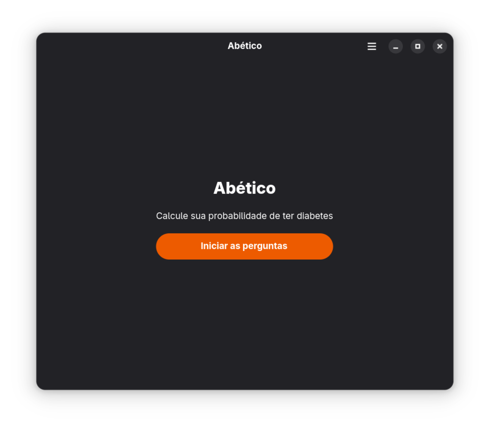
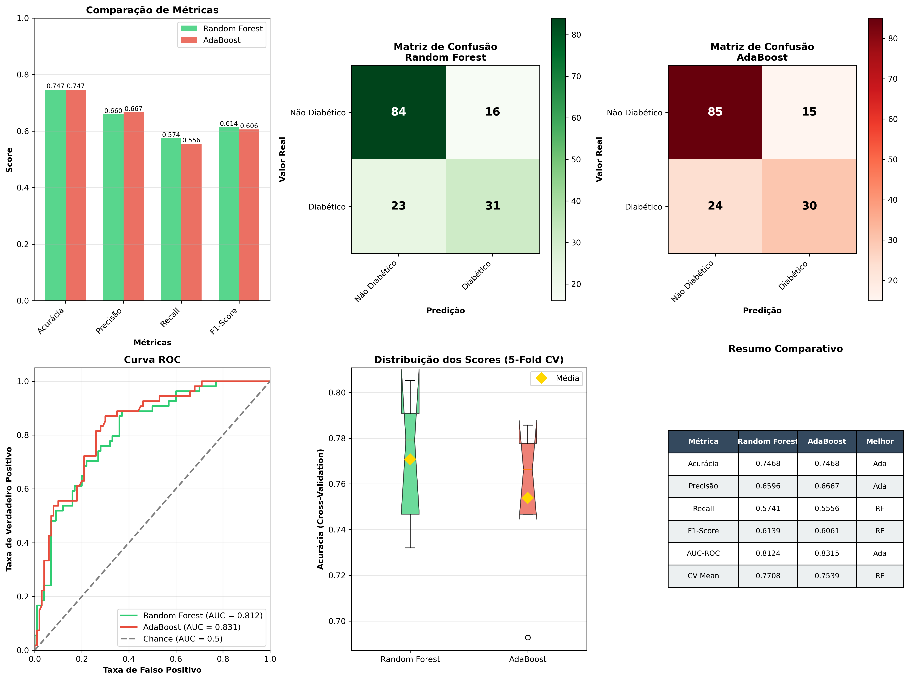

# Abético

Projeto de classificação de diabetes utilizando o **Pima Indians Diabetes Database** com técnicas de Machine Learning e com uma interface gráfica interativa.



*Interface gráfica do Abético para predição de diabetes*

## Sumário

- [Sobre o Projeto](#sobre-o-projeto)
- [Como Executar](#como-executar)
  - [Executando pelos Binários (Recomendado)](#executando-pelos-binários-recomendado)
  - [Executando Manualmente (Python)](#executando-manualmente-python)
- [Dataset](#dataset)
- [Metodologia](#metodologia)
  - [1. Feature Selection](#1-feature-selection)
  - [2. Treinamento dos Modelos](#2-treinamento-dos-modelos)
  - [3. Validação](#3-validação)
- [Resultados](#resultados)
- [Referências](#referências)
- [Autores](#autores)
- [Licença](#licença)

## Sobre o Projeto

Este projeto implementa um sistema de predição de diabetes utilizando algoritmos de Machine Learning. O objetivo é prever se um paciente tem diabetes com base em características clínicas, utilizando apenas as **features mais relevantes** identificadas através de análise de importância. O projeto inclui uma **interface gráfica em Python** que permite aos usuários inserir dados médicos e obter predições em tempo real sobre a probabilidade de diabetes.

### Objetivos:
- Identificar as features mais importantes para predição de diabetes
- Comparar diferentes algoritmos de ensemble learning
- Criar um modelo otimizado e eficiente
- Disponibilizar uma interface gráfica amigável para uso prático

## Como Executar

### Executando pelos Binários (Recomendado)

A forma mais simples de executar o Abético é usando os binários pré-compilados disponíveis nas [releases do projeto](https://github.com/erick-nix/abetico/releases).

#### Windows

1. Acesse a página de [Releases](https://github.com/erick-nix/abetico/releases)
2. Baixe o arquivo `Abetico.exe` da versão mais recente
3. Execute o arquivo `Abetico.exe`

#### Linux

1. Acesse a página de [Releases](https://github.com/erick-nix/abetico/releases)
2. Baixe o arquivo `Abetico.appimage` da versão mais recente
3. Execute o appimage `./Abetico.appimage`

### Executando Manualmente (Python)

Se você prefere executar o projeto diretamente do código-fonte ou deseja contribuir com o desenvolvimento:

#### 1. Clone o repositório

```bash
git clone https://github.com/erick-nix/abetico.git
cd abetico
```

#### 2. Instale as dependências

**Usando pip:**
```bash
pip install -r requirements.txt
```

**Ou se estiver usando Nix:**
```bash
direnv allow
```

#### 3. Execute o projeto com a interface gráfica

```bash
python main.py
```

#### 4. (Opcional) Treinar e selecionar modelos

Se você deseja retreinar os modelos de Machine Learning ou realizar a seleção de features:

```bash
# Seleção de features
python notebooks/model_selection.py

# Treinamento do modelo
python notebooks/train_model.py

# Seleção final de modelos
python notebooks/model_selection.py
```

## Dataset

**[Pima Indians Diabetes Database](https://www.kaggle.com/datasets/uciml/pima-indians-diabetes-database)**

O dataset contém informações médicas de pacientes indígenas Pima, uma população com alta incidência de diabetes.

### Features Originais (8):
| Feature | Descrição |
|---------|-----------|
| `Pregnancies` | Número de gestações |
| `Glucose` | Concentração de glicose no plasma (2h após teste oral) |
| `BloodPressure` | Pressão arterial diastólica (mm Hg) |
| `SkinThickness` | Espessura da dobra cutânea do tríceps (mm) |
| `Insulin` | Insulina sérica (mu U/ml) |
| `BMI` | Índice de Massa Corporal (peso em kg/(altura em m)²) |
| `DiabetesPedigreeFunction` | Função de pedigree de diabetes (histórico familiar) |
| `Age` | Idade (anos) |

**Target:** `Outcome` (0 = Não diabético, 1 = Diabético)

**Tamanho:** 768 amostras

## Metodologia

### 1. Feature Selection

#### 1.1 Análise de Importância

Utilizamos **Random Forest Regressor** para calcular a importância de cada feature:

```python
rf_model = RandomForestRegressor(n_estimators=100, random_state=42)
rf_model.fit(X, y)
importances = rf_model.feature_importances_
```

#### 1.2 Resultados com 8 Features

| Feature | Importância | Percentual |
|---------|-------------|------------|
| **Glucose** | 0.3234 | 32.34% |
| **BMI** | 0.1779 | 17.79% |
| **DiabetesPedigreeFunction** | 0.1252 | 12.52% |
| **Age** | 0.1191 | 11.91% |
| BloodPressure | 0.0843 | 8.43% |
| Pregnancies | 0.0685 | 6.85% |
| Insulin | 0.0522 | 5.22% |
| SkinThickness | 0.0494 | 4.94% |

**Insight:** As top 4 features (Glucose, BMI, DiabetesPedigreeFunction, Age) representam **~74%** da importância total.

#### 1.3 Redução de Features

Testamos o modelo usando apenas as **4 features mais importantes**:

| Feature | Importância | Percentual |
|---------|-------------|------------|
| **Glucose** | 0.3789 | 37.89% ⬆️ |
| **BMI** | 0.2487 | 24.87% ⬆️ |
| **DiabetesPedigreeFunction** | 0.2018 | 20.18% ⬆️ |
| **Age** | 0.1706 | 17.06% ⬆️ |

**Resultado:** A performance se manteve praticamente idêntica, indicando que as outras 4 features eram redundantes.

#### 1.4 Decisão Final

**Features Selecionadas:** `Glucose`, `BMI`, `DiabetesPedigreeFunction`, `Age`

### 2. Treinamento dos Modelos

#### 2.1 Modelos Testados

| Modelo | Descrição | Por que usar? |
|--------|-----------|---------------|
| **Random Forest** | Ensemble de múltiplas árvores de decisão | Robusto, reduz overfitting, boa performance |
| **AdaBoost** | Boosting adaptativo | Excelente para datasets pequenos/médios |

#### 2.2 Hiperparâmetros Otimizados

**Random Forest:**
```python
rf_params = {
    'n_estimators': [50, 100, 200],      # Número de árvores
    'max_depth': [5, 10, 15, None],      # Profundidade máxima
    'min_samples_split': [2, 5, 10]      # Min. amostras para split
}
```

**AdaBoost:**
```python
ada_params = {
    'n_estimators': [50, 100, 200],          # Número de estimadores
    'learning_rate': [0.01, 0.1, 0.5, 1.0]   # Taxa de aprendizado
}
```

Utilizamos **GridSearchCV** para encontrar a melhor combinação de parâmetros.

### 3. Validação

#### 3.1 K-Fold Cross Validation

- **Método:** 5-Fold Cross Validation
- **Shuffle:** Sim (random_state=42)
- **Métrica:** Mean Squared Error (MSE) - quanto menor, melhor

```python
kfold = KFold(n_splits=5, shuffle=True, random_state=42)
cross_val_score(model, X, y, cv=kfold, scoring='neg_mean_squared_error')
```

#### 3.2 Por que K-Fold?

- Avalia o modelo em diferentes subconjuntos dos dados
- Previne overfitting
- Fornece estimativa mais confiável da performance real
- Maximiza o uso dos dados (importante para datasets pequenos)

## Resultados

### Performance dos Modelos

Após treinamento com **GridSearchCV** e validação cruzada 5-fold, obtivemos os seguintes resultados:

#### Random Forest Classifier

| Métrica | Valor |
|---------|-------|
| **Acurácia** | 74.68% |
| **Precisão** | 65.96% |
| **Recall** | 57.41% |
| **F1-Score** | 61.39% |
| **AUC-ROC** | 81.24% |
| **Score CV (treino)** | 76.38% |

**Melhores Hiperparâmetros:**
- `n_estimators`: 50
- `max_depth`: 5
- `min_samples_split`: 10

#### AdaBoost Classifier

| Métrica | Valor |
|---------|-------|
| **Acurácia** | 74.68% |
| **Precisão** | 66.67% |
| **Recall** | 55.56% |
| **F1-Score** | 60.61% |
| **Score CV (treino)** | 77.03% |

**Melhores Hiperparâmetros:**
- `n_estimators`: 200
- `learning_rate`: 0.5

### Modelo Vencedor

**Random Forest Classifier** foi selecionado como o melhor modelo (score total: **3.4067**), apresentando:

- Melhor equilíbrio entre precisão e recall
- AUC-ROC superior (81.24%)
- F1-Score ligeiramente maior
- Melhor generalização para dados não vistos



## Referências

- **Dataset:** [Pima Indians Diabetes Database - UCI Machine Learning Repository](https://www.kaggle.com/datasets/uciml/pima-indians-diabetes-database)
- **Scikit-learn Documentation:** https://scikit-learn.org/

## Autores

- **Emilli Giuliane Pereira Lima**
- **Erick Henrique Souza de Paula** - [GitHub](https://github.com/erick-nix)
- **Gabriel Oliveira Delorenzo**
- **Ketlhen Nunes de Carvalho**
- **Letícia Ferreira Pinto**

## Licença
Este projeto está licenciado sob a licença MIT. Veja o arquivo [LICENSE](LICENSE) para mais detalhes.
